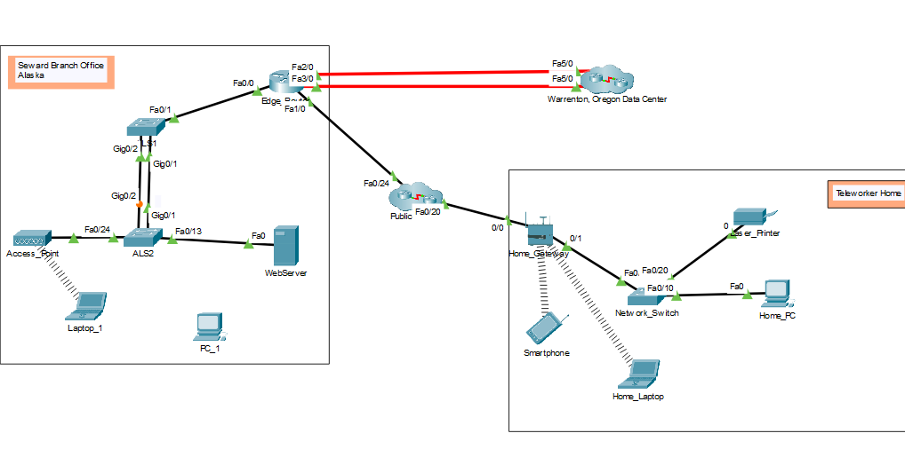
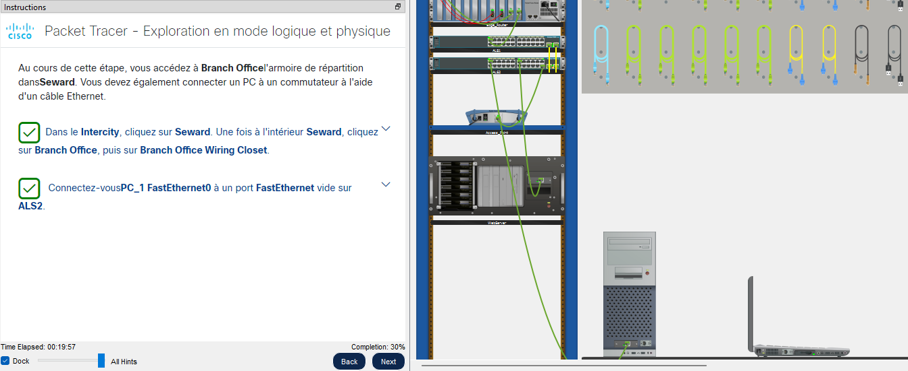
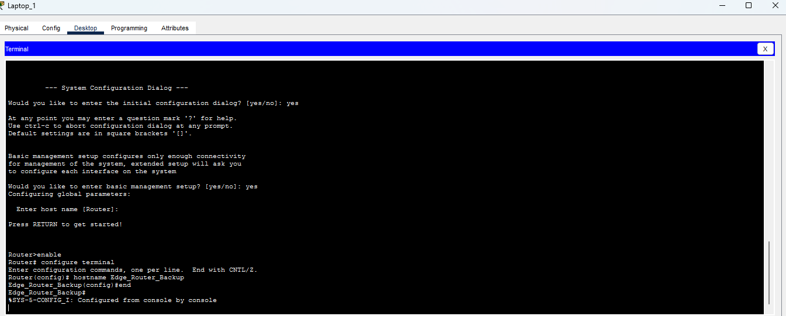

# Lab 02 - Exploration des modèles logiques et physiques (activité PTTA1 Cisco)

📅 Date de réalisation : Mercredi 29 juillet 2026

## 🎯 Objectif

Se familiariser avec l'environnement Cisco Packet Tracer.
Examiner les dispositifs dans une armoire de cablage
Connecter les terminaux entre eux.
Installer un routeur de secours.
Configurer un nom d'hôte.

---

## 🏗️ Topologie proposé

Le réseau est composé de :
- un pc portable sans fil
- un moniteur de pc fixe
- un Edge_Router
- 2 switchs (ASL1 et ASL2)
- 1 point d'accès
- 1 serveur Web

---

## ⚙️ Étapes de réalisation

Dans un premier temps dans cette activité, on apprend la topologie du réseau étudier. Tant sur le modèle physique que logique. 

Par la suite on nous propose un scénario dans lequel on dois gerer un placard de cablage à travers divers exercices.

Le premier exercice consiste à connecter un ordinateur portable à un switch ALS1 à l’aide d’un câble Ethernet.

Dans le deuxième exercice, nous devons mettre en place un routeur de secours (backup routeur) et le relier à l’ordinateur portable. Cet exercice nous permet notamment de découvrir qu’il est également possible d’établir une connexion entre un PC et un équipement réseau grâce à un câble USB.
Ainsi, le câble Ethernet n’est pas l’unique solution pour connecter des ordinateurs récents aux équipements réseau. Les connexions USB peuvent également être utilisées dans certains cas, notamment pour la configuration ou la gestion des équipements.

Pour finir dans le dernier exo on nous ammène a configurer le nom d'hôte d'un routeur grâce aux commandes Cisco.
Pour ce faire on utilise les commandes suivantes: 
  - Router> enable
  - Router# configure terminal
  - Router(config)# hostname Edge_Router_Backup
  - Edge_Router_Backup(config)# end

---

## ⭐ Niveau de difficulté : ⭐☆☆☆☆

---

## 💭 Réflexion personnelle

Activité très intéressante.
