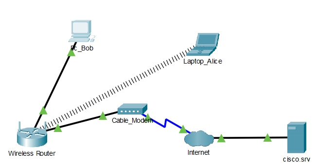
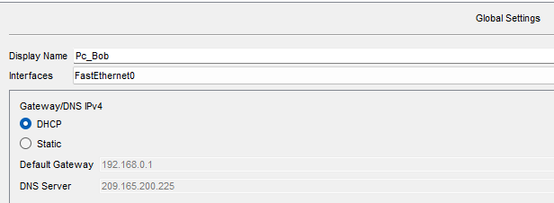
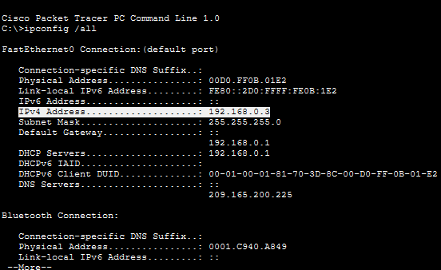
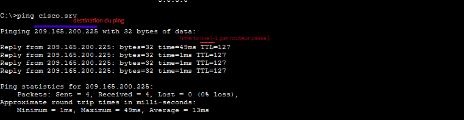
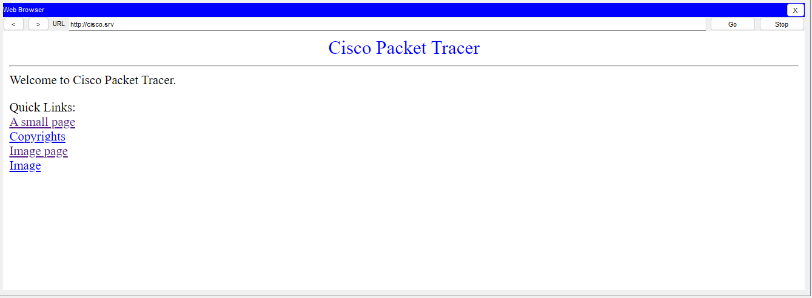

# Lab 03 - Création d'un réseau domestique simple

📅 Date de réalisation : Lundi 3 aout 2026

## 🎯 Objectif

Construire un réseau simple en suivant l'activité proposé par Cisco Packet Tracer.
Configurer les end devices et vérifier les connectivités entre appareils.

---

## 🏗️ Topologie proposé

Dans cet activité il nous est demandé d'installer le matériel suivant :

- un Ordinateur fixe
- un PC portable
- un modem câble
- un routeur sans-fil
- un cloud
- serveur

L'architecture obtenu à la fin de l'activité est représenter par l'image ci-dessous

---

## ⚙️ Étapes de réalisation

### 1. Installation des appareils

La première étape de cette activité concerne l'installation et le renommage des appareils. Pour faire cette dernière on se rend dans l'onglet 'Config' après avoir cliqué sur l'appareil en question.

### 2. Connexion des appareils entre eux

Dans la seconde étapes on est amené à relier les appareils de notre réseaux. 
On relie l'ordinateur fixe (port *FastEthernet0*) au port *Ethernet 1* du routeur sans fil et faisons de même pour relier routeur sans-fil au câble modem.

La documentation de Cisco nous renseigne sur le fait suivant:
*Un câble modem est un périphérique matériel qui permet de communiquer avec un Fournisseur d'Accès à Internet (FAI). Le câble coaxial du FAI est connecté au câble modem, et un câble Ethernet du réseau local est également connecté. Le câble modem convertit la connexion coaxiale en connexion Ethernet.*

### 3. Configurer la partie réseau de l'ordinateur fixe

Avant toute chose il est important de se renseigner sur ce qu'est le *DHCP*. Le DHCP (Dynamic Host Configuration Protocol ou protocole de configuration dynamique des hôtes) est un système qui donne une adresse IP et un masque de sous-réseau à nos appareils de façon automatique. Il sert à connecter un ordinateur, un téléphone ou une télé au réseau sans rien régler à la main.
Ainsi pour connecter le PC au routeur, nous sommes allé dans l'onglet PC/Desktop/Ip Configuration et avons selectionner l'option 'DHCP' au lieu de static. Cela nous a permit d'obtenir une adresse IPV4 automatiquement.

La commande 'ping cisco.srv' nous a permis de vérifier que la connexion entre l'ordinateur et le routeur est fonctionnelle, puisque le serveur répond aux requêtes ICMP.

### 3. Configurer la partie réseau de l'ordinateur portable

Pour ce faire nous avons du dans un premier temps retirer la carte r"seau filaire pour la remplacer par une carte sans fil (WPC300N) puis sommes partie dans l'onglet connexion pour relier l'appareil au routeur.
Pour verifier la connectivité je me suis rendu dans l'onglet Desktop/Navigateur Web et est saisie 'cisco.srv'. La page s'affichant j'ai donc pu en conclure que le pc est bel et bien relié à Internet.

---

## 📚 Remarque

*Les adresses IP des terminaux peuvent aller de 192.168.0.2 à 192.168.0.254. Chaque carte réseau reçoit une adresse IP unique sur le même réseau.
Le masque de sous-réseau IPv4 est utilisé pour différencier la partie réseau de la partie hôte d'une adresse IPv4. Vous pouvez associer l'adresse IP à votre adresse municipale. Le masque de sous-réseau définit la longueur du nom de la rue. La partie réseau de l'adresse correspond à votre rue, 192.168.0. Le numéro de maison correspond au port hôte de l'adresse IP. Pour l'adresse IP 192.168.0.2, le numéro de rue est 2 et la rue est 192.168.0. S'il y a plusieurs maisons dans la même rue, par exemple, la maison numéro 3 aura pour adresse 192.168.0.3. Le nombre maximum de maisons dans cette rue est de 253, allant de 2 à 254.
La passerelle par défaut est analogue au carrefour. Le trafic de la rue 192.168.0 doit sortir par l'intersection vers une autre rue. Une autre rue est un autre réseau. Dans ce réseau, la passerelle par défaut est le routeur sans fil qui dirige le trafic du réseau local vers le câble modem, puis le trafic est envoyé au FAI.*
D'après le site Cisco.

---

## ⭐ Niveau de difficulté : ⭐☆☆☆☆
